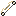
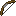
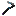

# 🏗️ Ability Tools

Ability Tools is a fabric Minecraft mod that adds a bunch of tools, weapons, and armor to the game.

## 💾 Installation

Download the mod on [Modrinth](https://modrinth.com/mod/ability-tools) and put it in your mods directory. 
This mod require the [fabric api](https://modrinth.com/mod/fabric-api)

## 🏢 Features

🪓Axes

####  Experience Axe

Gives experience when damaging an entity

⚔️Swords

####  Ender Sword

Teleports you forward and gives you speed 
10 second cooldown

####  Ground Slam Dagger

Right-clicking a block (Ground slamming) will damage a 3rd of all entities health in a 5 block radius 
45 second cooldown

####  Heal Sword

Heals 4 of your health 
10 second cooldown

####  Group Heal Sword

Heals every player by 6 health in a 5 block radius 
10 second cooldown

####  Jump Sword

Boosts you into the air damaging entities for 4 hearts and freezing them for a second 
30 second cooldown

####  Money Sword

Does 0.25 extra bonus damage for every level you have

####  Multi Sword

Does 3 damage to all entities in a 5 block radius of the entity you hit.

####  Roid Rage Sword

Does 25 extra damage for 5 seconds 
20 second cooldown

####  Speedy Sword

Doubles movement speed for 25 seconds 
4 second cooldown

🏹Bows

####  Aftershock Bow

Applies glowing and damages entities 4 seconds after being shot

####  End Bow

Teleports you wherever you shoot

####  Fast Bow

Instantly draws back

####  Multi Bow

Shoots 4 arrows at once. Takes 4 arrows to shoot

####  Roid Rage Bow

Does double damage

####  TNT Bow

Explodes on impact

⛏️Pickaxes

####  Experience Pickaxe

1 in 5 chance to give a lot of experience

####  Progressive Pickaxe

Gives a 1% boost in mining speed for every 100 blocks mined

####  Soul Pickaxe

Gives 50% more ore per entity near you in a 50 block radius

🪖Armor

####  Fortune Armor

When wearing the whole set of armor, you get 2 extra ore

####  Miner Armor

When wearing the whole set of armor, you get extra mining speed

####  Speedy Armor

When wearing the whole set of armor, you get extra movement speed

🌲Misc

####  Fire Stick

Spawns a circle in a 5 block radius that damages entities in that circle every second 
30 second cooldown

####  Freeze Stick

Spawns a circle in a 3 block radius that freezes entities for a second after 2 seconds 
30 second cooldown

####  Lightning Stick

On right click, you spawn lightning around you in a 10 block radius. It also spawns lightning when you hit an entity. 
5 second cooldown

####  Roid Rage Gun

Literally just a gun 

####  Ice Gun

Slows enemies on impact. Does more damage than the Roid Rage Gun 
2 second cooldown

## 🔎Contributing

Issues are welcome both in my [discord](https://discord.gg/23KfgguXMC) and on [GitHub](https://github.com/chowiekomba/ability-tools/issues)

## 📜License

[Custom License](LICENSE)